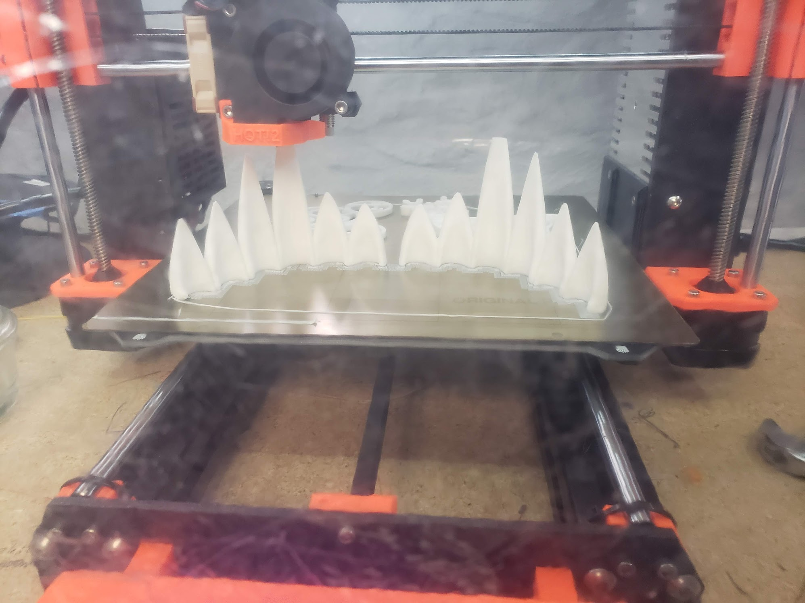
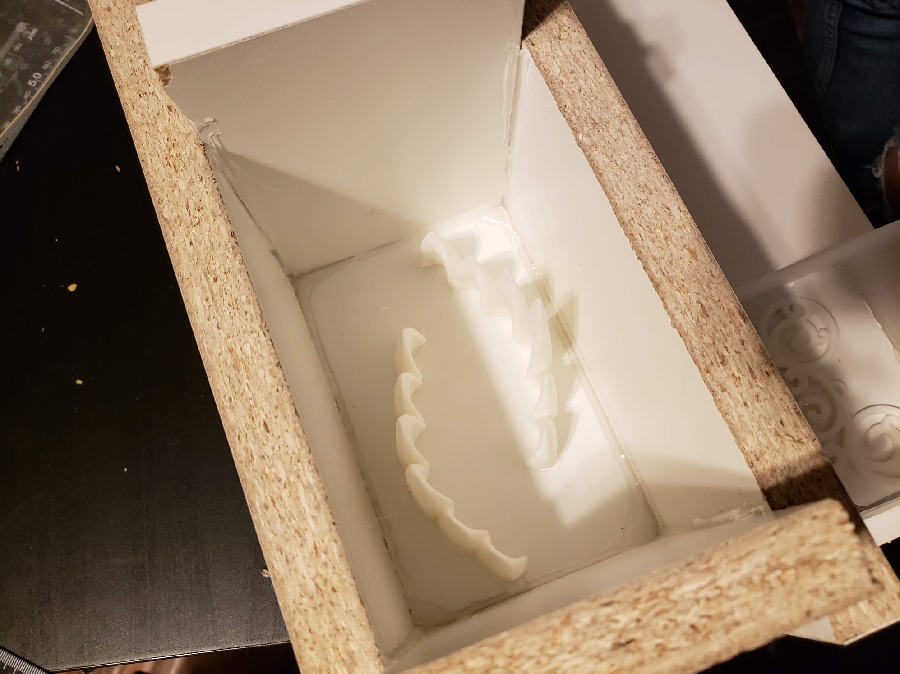
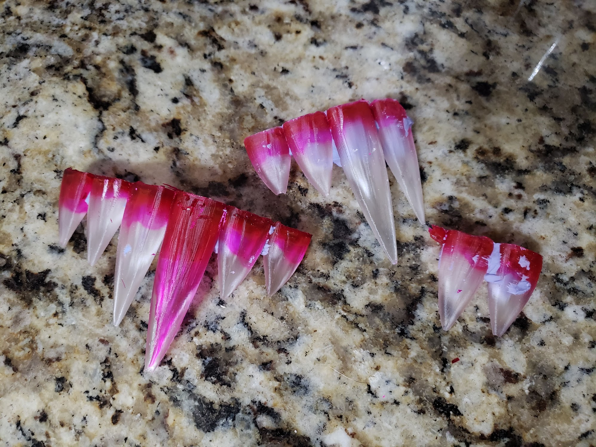
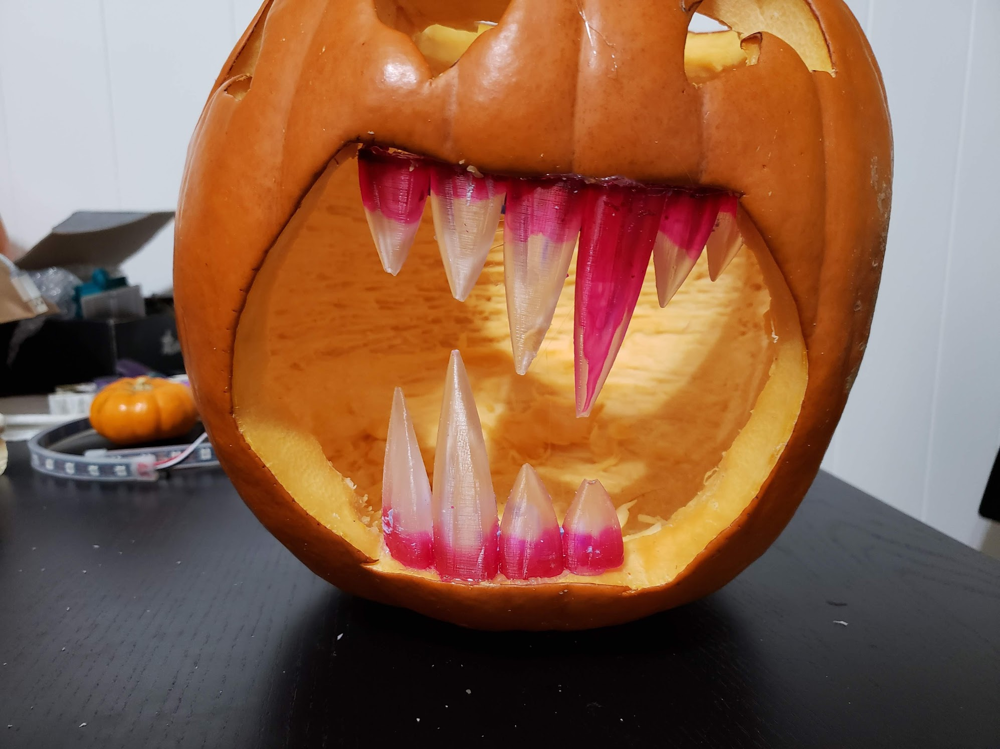

# Screamin Pumpkin or I've got something in my teeth!

This is the code for a pumpkin my wife and I worked on for this year's Paradowski pumpkin carving contest.

## The screaming part

The idle routine for the pumpkin is a slowly pulsing red light from the LED strip. The little pumpkin has a capacitive touch sensor attached, so when you touched it, a witch cackle sound effect played and the neopixel strip flashed white and purple.

Here's a video I shot of the final version:

[https://vimeo.com/298082737](https://vimeo.com/298082737)

I had some other ideas that I wanted to incorporate into the pumpkin, but in the end I decided to go with the MVP (most valuable pumpkin) features.

## The fangs

The fangs on the pumpkin are from this thingiverse, well, thing:

https://www.thingiverse.com/thing:3171575

The fangs are meant for human sized mouths, not pumpkins, so I scaled up the mesh, chopped off the back, and 3d printed it.

The printed versions served two purposes:

- Positives for the silicone mold we'd use to create resin versions of the fangs
- Backups just in case the resin versions didn't turn out well

From here my wife and I created box for the mold:

And then created the mold itself:

From there we poured in clear resin and added red alcohol dye:

And then added the fangs to the pumpkin!

## Hiding the hardware

I'm kicking myself for not getting a good picture of it, but you can see it in the video; my wife came up with an awesome idea for hiding the electronics.

She suggested creating a frosted wall that would obsucre the view to the elctronics while allowing the light to come through. Her approach was to take a transparancy sheet (like from the old school overhead projectors) and use some frosted spray paint to make it translucent instead of transparent.

The end result was a fantastic/fast/cheap way of creating a frosted window effect that I cut to fit and pinned to the inside of the pumpkin.

:emoji-for-kissing-fingers-like-a-chef-to-signify-how-good-it-looked:

## Circuit diagram

I didn't make one. The idealist in me says "yeah I'll come back in and map it out some day" but the realist in me says "yeaaaaah, that's not likely to happen".

That said, I used the following hardware to make this work:

### Adafruit Circuit Playround Express

https://www.adafruit.com/product/3333

I used this as the main board. It handled the neopixel strip code and the capactive touch trigger. The `circuitpython/code.py` file runs on this board.

Really, I could have done all of this with only this board, but the speaker on the playground wasn't as loud as I wanted it to be. So I used another board.

### Feather M0 Basic Proto

https://www.adafruit.com/product/2772

I used this board to run the music maker wing than handled the sound effects. The `sound-player.ino/sound-player.ino` code runs on this board.

At one point I was going to add a motor into the project with an off balance weight so that the pumpkin shook when it triggered, but I ended up scrapping it in the end because there wasn't enough room inside the pumpkin. If I had included it, the motor would have been triggered from this board.

### Feather Music Maker Wing

https://www.adafruit.com/product/3436

This wing is attached to the basic proto board. I got this and the proto board for a different in-progress project and it's fantastic. I tried to create my own amplifier circuit in that in-progress project and it ... did not go well. This wing is so much easier.

### Neopxiel LED strip

https://www.adafruit.com/product/3811

I got this neopixel strip a bit ago to use as a prototyping strip and _holy cow_ is it nice for prototyping. It's also nice for quick ad-hoc projects like this :)

## Second place

In the end I got second place in the pumpkin carving contest. I think it was fair; the winning pumpkin was legit very good. The judges were remote so they couldn't interact with my pumpkin, so that didn't work well in my favor.

Ultmiately, I'm most happy about teaming up with my wife to concept and build this pumpkin in a short span of time and about the new stuff I learned along the way. It was a productive pumpkin project! :tada:
